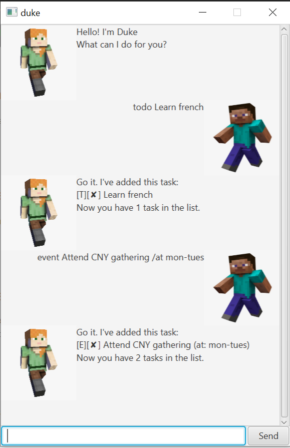

# Welcome to Duke!
This is a project template for a greenfield Java project. It's named after the Java mascot _Duke_. Given below are instructions on how to use it.
## Setting up in Intellij
### Prerequisites: 
* JDK 11
* update Intellij to the most recent version.
* JavaFX 11
### Steps
1. Open Intellij (if you are not in the welcome screen, click `File` > `Close Project` to close the existing project dialog first)
1. Set up the correct JDK version, as follows:
   1. Click `Configure` > `Structure for New Projects` and then `Project Settings` > `Project` > `Project SDK`
   1. If JDK 11 is listed in the drop down, select it. If it is not, click `New...` and select the directory where you installed JDK 11
   1. Click `OK`
1. Import the project into Intellij as follows:
   1. Click `Open or Import`.
   1. Select the project directory, and click `OK`
   1. If there are any further prompts, accept the defaults.
1. After the importing is complete, locate the `src/main/java/Main.java` file, right-click it, and choose `Run Main.main()`. If the setup is correct, you should see something like the below:
1. Type a command in the command box at the bottom and press `Enter` to execute it. 
1. Type `Bye` or click the  `'x'` button to close the window.

## Features
###### **Notes about the command format**:
* Do not use character '/' unless otherwise stated by the user guide as it is used as a String delimiter.
* Use a whitespaces to separate different arguments for inputs.
    * E.g `tag 2 favourite` uses whitespace to separate command, index and Tag Name arguments.

### Task Creation
##### Adding a ToDo: `todo`

Adds a ToDo task to the Task List.

Format: todo `NAME`
* Must include `NAME`, cannot be empty.

Examples:
* `todo Finish CS1010 Tutorial`
    * `[T]` `[✓]` _`Finish CS1010 Tutorial`_
    * Now you have 2 tasks in the list.
    
##### Adding an Event `event`

Adds an Event task to the Task List.

Format: todo `NAME /at TIMEFRAME`
* Use `/at` to indicate the rest of the line as the event's `TIMEFRAME`. 
    * `TIMEFRAME` is saved as a _String_.

Examples:
* `event Attend CS2103T tutorial. /at mon 8am to tues 10am` 
    * `[E]` `[✘]` _`attend CS2103T tutorial`_ (at: _`mon 8am to tues 10am`_).
    * Now you have 2 tasks in the list.
    
    
    
##### Adding a deadline `deadline`

Adds a Deadline task to the Task List.

Format: deadline `NAME /by DATE`
* Use `/by` to indicate the rest of the line as the event's `DATE`. 
    * `DATE` must be saved in the following format: *_YYYY-MM-DD_*.

Examples:
* `deadline Complete Math lab /by 2020-03-04` 
    * `[D]` `[✘]` _`Complete Math lab`_ (at: _`03 APR 2020`_).
    * Now you have 2 tasks in the list.
    
### Task Commands

##### List Tasks `list`

List all tasks currently in Task list

Format: list

Examples: `Here are the tasks in your list:`
1. `[T]` `[✘]` Take laundry
1. `[T]` `[✘]` Check email

Now you have 2 tasks in the list.

##### Mark Done `done`

Marks Task as Done. Use this when you want to indicate your task has been completed.

Format: done `INDEX`
* Use the task's index to specify which task. Use `list` to refer to which task to mark done.
* `INDEX` must be a positive integer and within the Task List size.

Example: `Done 2`
* `[D]` `[✓]` `Fight thanos`

##### Delete Task `delete`

Remove Task from Task List.

Format: delete `INDEX`
* Use the task's index to specify which task. Use `list` to refer to which task to mark done.
* `INDEX` must be a positive integer and within the Task List size.

Example: `Delete 2`
* Noted. I've removed this task: 
    * `[T]` `[✘]` `Finish Homework`
    * Now you have 6 tasks in the list.

##### Find Task `find`

Finds list of tasks of matching names

Format: find `SUBNAME`
* `SUBNAME` is compulsory, empty inputs are not supported.

Example: `find book`
* Here are the matching tasks in your list: 
    * `[T]` `[✓]` `Read Harry Potter book`
    * `[D]` `[✘]` `Return Harry Potter book` (by: `03 APR 2020`) 
    
##### Tag Task `tag`

Tags task with `#`.

Format: tag `INDEX` `NAME`
* Use the task's index to specify which task. Use `list` to refer to which task to mark done.
* `INDEX` must be a positive integer and within the Task List size.
* `NAME` is compulsory, it cannot be empty.

Example: `tag 2 impt`
* Noted. The following task has been tagged!
    * `[T]` `[✘]` `Project work` _`#impt`_
    
## Exit

##### Close bot `bye`

Close and exit Duke.

## Saving Tasks

Tasks locally saved in _Data_atb folder as a txt called _Duke.txt_

## Command Summary
Action | Format
------------ | -------------
todo | `NAME`
deadline | `NAME` `/by` `DATE`
event | `NAME` `/at` `TIMEFRAME`
list | 
done | `INDEX`
delete | `INDEX`
find | `SUBNAME`
tag | `INDEX` `TAGNAME`
bye | 